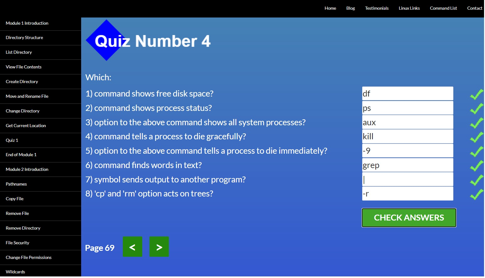

# kottans-frontend
# Stage 0 

General
 
 
- [X] [Git Basics](https://github.com/kottans/frontend/blob/2022_UA/tasks/git-intro.md)  
- [X] [Linux CLI and Networking](https://github.com/kottans/frontend/blob/2022_UA/tasks/linux-cli-http.md)  
- [ ] [VCS (hello gitty), GitHub and Collaboration](https://github.com/kottans/frontend/blob/2022_UA/tasks/git-collaboration.md)  
 

   

Front-End Basic
 
 
- [ ] [Intro to HTML & CSS](https://github.com/kottans/frontend/blob/2022_UA/tasks/html-css-intro.md)  
- [ ] [Responsive Web Design](https://github.com/kottans/frontend/blob/2022_UA/tasks/html-css-responsive.md)  
- [ ] [HTML & CSS Practice](https://github.com/kottans/frontend/blob/2022_UA/tasks/html-css-popup.md)  
- [ ] [JavaScript Basics](https://github.com/kottans/frontend/blob/2022_UA/tasks/js-basics.md)  
- [ ] [Document Object Model](https://github.com/kottans/frontend/blob/2022_UA/tasks/js-dom.md) 
 

   

Advanced Topics
 
 
- [ ] [Building a Tiny JS World](https://github.com/kottans/frontend/blob/2022_UA/tasks/js-pre-oop.md)  
- [ ] [Object oriented JS](https://github.com/kottans/frontend/blob/2022_UA/tasks/js-oop.md)  
- [ ] [OOP exercise](https://github.com/kottans/frontend/blob/2022_UA/tasks/js-post-oop.md)  
- [ ] [Offline Web Applications](https://github.com/kottans/frontend/blob/2022_UA/tasks/app-design-offline.md)  
- [ ] [Memory pair game](https://github.com/kottans/frontend/blob/2022_UA/tasks/memory-pair-game.md)  
- [ ] [Website Performance Optimization](https://github.com/kottans/frontend/blob/2022_UA/tasks/app-design-performance.md)  
- [ ] [Friends App](https://github.com/kottans/frontend/blob/2022_UA/tasks/friends-app.md)  
 

   

## Git Basics  

Доступно, без примеров на Python было бы лучше т.к. с этим языком не знаком.
 

Screenshots

 

 
 
  
 
 
 
 

  
 

## Linux CLI, and HTTP  

Screenshots

  
 

  
   

  
   

  
    

  
   

В планах установить Ubuntu на борт и практиковаться дальше. 
